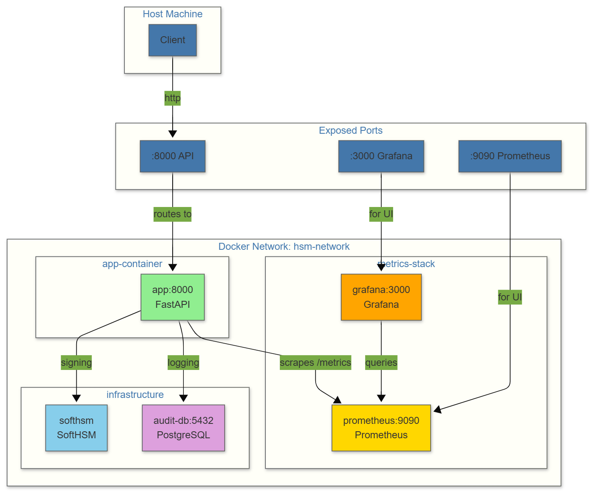

# Aadhaar HSM Gateway

A Docker-based authentication gateway that uses SoftHSM for cryptographic signing of Aadhaar biometric authentication requests.

## Overview

This project provides a secure API gateway that:
- Signs authentication requests using a Hardware Security Module (SoftHSM)
- Logs all cryptographic operations to PostgreSQL
- Exposes Prometheus metrics for monitoring
- Visualizes metrics with Grafana dashboards

## Architecture



> Tip: Also see `architecture.mmd` for Mermaid diagram.

```
┌─────────────────────────────────────────────────────────────────┐
│                    hsm-network (bridge)                        │
│                                                             │
│   ┌──────────────────────┐      ┌────────────────────┐  │
│   │    grafana:3000      │      │   prometheus:9090 │  │
│   │    (metrics UI)     │◄─────│  (scrapes app)  │  │
│   └──────────────────────┘      └────────┬─────────┘  │
│          │                                    │           │
│    ┌─────┴──────────┐              ┌───────┴──────────┐  │
│    │ softhsm-poc    │              │   app:8000       │  │
│    │ (SoftHSM HSM)  │◄─────────────│  (FastAPI)       │  │
│    └────────────────┘              └────────┬─────────┘  │
│                                                │           │
│                                   ┌────────────┴──────────┐ │
│                                   │   audit-db:5432      │ │
│                                   │   (PostgreSQL)       │ │
│                                   └──────────────────────┘ │
└─────────────────────────────────────────────────────────────┘
        │
   [exposed ports to host]
        │
    :8000   →   /health, /auth/sign, /metrics
    :9090   →   Prometheus UI
    :3000   →   Grafana UI (admin/admin123)
```

## Quick Start

### Prerequisites
- Docker
- Docker Compose

### Build & Run

```bash
# Start all services
docker compose up -d

# Verify services are running
docker compose ps
```

### Test the API

```bash
# Health check
curl http://localhost:8000/health

# Sign authentication request
curl -X POST http://localhost:8000/auth/sign \
  -H "Content-Type: application/json" \
  -d '{
    "aadhaar_ref": "TEST-12345",
    "biometric_data": "test_biometric_data",
    "user_id": "user001",
    "purpose": "authentication"
  }'

# Get metrics
curl http://localhost:8000/metrics
```

## API Endpoints

| Method | Endpoint | Description |
|--------|----------|-------------|
| GET | `/` | Service info |
| GET | `/health` | Health check |
| POST | `/auth/sign` | Sign auth request |
| GET | `/metrics` | Prometheus metrics |
| GET | `/admin/keys` | List HSM keys |
| GET | `/admin/audit-log` | Get audit logs |

## Environment Variables

| Variable | Default | Description |
|----------|---------|-------------|
| `HSM_LIBRARY` | `/usr/lib/softhsm/libsofthsm2.so` | SoftHSM library path |
| `HSM_TOKEN_LABEL` | `AuthToken` | HSM token label |
| `HSM_USER_PIN` | `12345678` | HSM user PIN |
| `DB_HOST` | `postgres` | Database host |
| `DB_NAME` | `aadhaar_audit` | Database name |
| `DB_USER` | `audit_user` | Database user |
| `DB_PASSWORD` | `AuditPass2025!` | Database password |
| `API_PORT` | `8000` | API port |

## Available Services

| Service | Port | Credentials |
|---------|-----|-------------|
| API | 8000 | - |
| Prometheus | 9090 | - |
| Grafana | 3000 | admin/admin123 |
| PostgreSQL | 5432 | audit_user/AuditPass2025! |

## Prometheus Metrics

- `auth_requests_total` - Total authentication requests
- `hsm_signatures_total` - Total HSM signatures
- `mock_signatures_total` - Total mock signatures (fallback)
- `key_rotations_total` - Total key rotations
- `hsm_connected` - HSM connection status (1=connected)

## Grafana Setup

1. Open http://localhost:3000
2. Login: `admin` / `admin123`
3. Add Prometheus data source:
   - Configuration → Data Sources → Add
   - Select Prometheus
   - URL: `http://prometheus:9090`
   - Save & Test
4. Create dashboard with queries:
   - `auth_requests_total`
   - `hsm_signatures_total`
   - `rate(auth_requests_total[5m])`

## Project Structure

```
aadhaar-hsm-poc/
├── app/
│   ├── main.py           # FastAPI application
│   ├── hsm_wrapper.py   # SoftHSM wrapper
│   ├── audit_logger.py   # Audit logging
│   └── key_rotation_manager.py
├── postgress/
│   └── init.sql         # Database schema
├── prometheus/
│   └── prometheus.yml   # Prometheus config
├── docker-compose.yml  # Docker services
├── Dockerfile           # App container
├── requirements.txt     # Python dependencies
├── .env                # Environment variables
├── config.yaml         # Application config
└── test_api.sh         # API tests
```

## Stopping Services

```bash
# Stop all services
docker compose down

# Stop and remove volumes
docker compose down -v
```

## Troubleshooting

### Check logs
```bash
docker compose logs app
docker compose logs softhsm
docker compose logs postgres
```

### Verify HSM connectivity
```bash
curl http://localhost:8000/admin/keys
```

### Check metrics
```bash
curl http://localhost:8000/metrics | grep hsm_connected
```

## License

MIT